# Table of Available Items

Here are **all** available item renames in the resource pack as of version `v3.69.0-release`.

Items marked with * at the end can have additional characters after the main name.

::: warning WARNING
This page was translated using the ChatGPT neural network. If you notice any errors, please contact the [TRZ Team suggestion bot](https://t.me/TRZteam_bot).
:::

## Food

|Image|Rename|Item|
|:-:|:-:|:-:|
|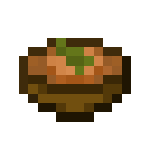|Onion Soup|Stew, Beetroot Soup, Suspicious Stew|
|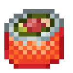|Rolls|Raw Cod, Raw Salmon, Tropical Fish|
|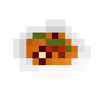|Ratatouille|Stew, Beetroot Soup, Suspicious Stew|
|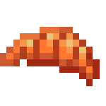|Croissant|Bread|
|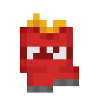|Chips|Baked Potato|
|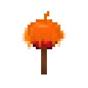|Caramel Apple|Apple|
|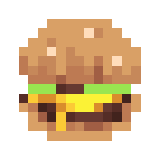|Burger|Bread|
|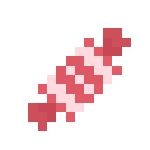|Candy|Cookie|
|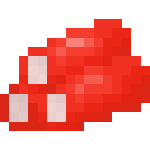|Crab Sticks|Raw Cod, Raw Salmon, Tropical Fish|
|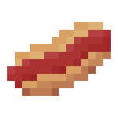|Hot Dog|Steak, Bread, Golden Carrot, Cooked Rabbit, Cooked Chicken, Cooked Porkchop|
|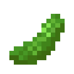|Cucumber|Carrot|
|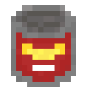|Canned Food|Steak, Cooked Rabbit, Cooked Chicken, Cooked Porkchop|
|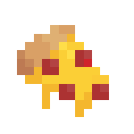|Pizza Slice|Steak, Bread, Golden Carrot, Cooked Rabbit, Cooked Chicken, Cooked Porkchop|
|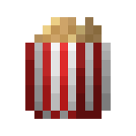|Popcorn|Bread|
|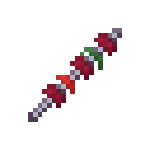|Shashlik|Steak, Golden Carrot, Cooked Rabbit, Cooked Chicken, Cooked Porkchop|
|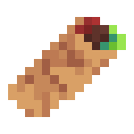|Shawarma|Bread, Golden Carrot|
|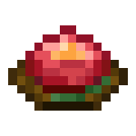|Beef Tartare|Raw Beef|
|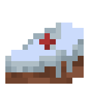|Cake Slice|Cookie|
|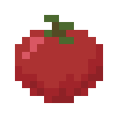|Tomato|Potato|
|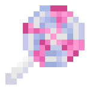|Леденец|Cookie|

## Drinks

|Image|Rename|Item|
|:-:|:-:|:-:|
|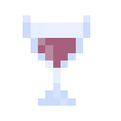|Wine Glass|Any Potion|
|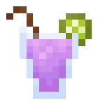|Cocktail*|Any Potion|
|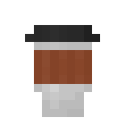|Coffee|Any Potion|
|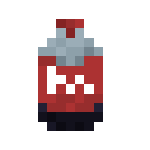|Cola Bottle|Any Potion|
|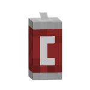|Cola Can|Any Potion|
|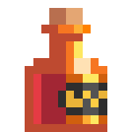|Cognac|Any Potion|
|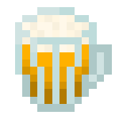|Beer|Any Potion|
|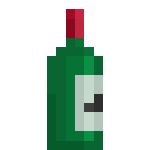|Wine|Any Potion|

## Totems

|Image|Rename|Item|
|:-:|:-:|:-:|
|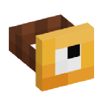|Clock|Totem of Undying|
|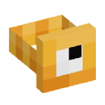|Golden Clock|Totem of Undying|
|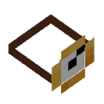|Small Clock|Totem of Undying|
|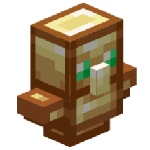|Plush Totem|Totem of Undying|
|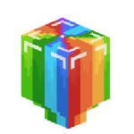|Воздушный шарик|Totem of Undying|

## Musical Instruments

|Image|Rename|Item|
|:-:|:-:|:-:|
|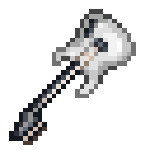|Bass Guitar|Leather Horse Armor (Texture can be any color)|
|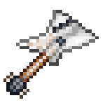|Electric Guitar|Leather Horse Armor (Texture can be any color)|
|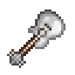|Guitar|Leather Horse Armor (Texture can be any color)|
|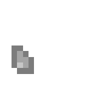|Pick|Leather Horse Armor (Texture can be any color)|
|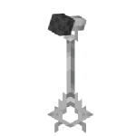|Microphone Stand|Iron Ingot|
|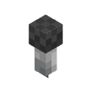|Microphone|Iron Ingot|

## Weapons

|Image|Rename|Item|
|:-:|:-:|:-:|
|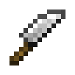|Knife|Any Sword|
|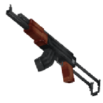|AK-47|Bow|
|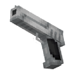|Deagle|Bow|
||Golden Deagle|Bow|
|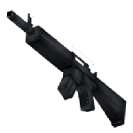|M16|Bow|
|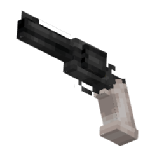|Revolver|Crossbow|
||Водный пистолет|Bow|

## Hats and armor
|Image|Rename|Item|
|:-:|:-:|:-:|
|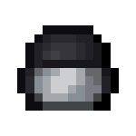|Шлем полицейского|Any helmet|
|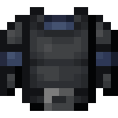|Нагрудник полицейского|Any chestplate|
|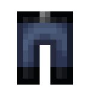|Штаны полицейского|Any leggings|
|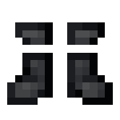|Ботинки полицейского|Any boots|
||Коробка|Carved pumpkin|
|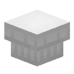|Поварский колпак|Carved pumpkin|
|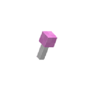|Пупа-пупс|Carved pumpkin|
||Тёмные очки|Carved pumpkin|
||Рождественский колпак|Carved pumpkin|
||Ушанка|Carved pumpkin|
||Клоунский нос|Carved pumpkin|
||Клоунский парик|Carved pumpkin|

## Furniture
|Image|Rename|Item|
|:-:|:-:|:-:|
||Ноутбук|Iron ingot|
||Чемодан|Any shulker|

## ZUNO
### What is ZUNO? 
ZUNO is a card game in ZXRP, created based on the real card game [UNO](https://www.letsplayuno.com/).

|Image|Rename|Item|
|:-:|:-:|:-:|
||ZUNO 0-9|Leather horse armor (Texture can be any color)|
||ZUNO plus2|Leather horse armor (Texture can be any color)|
||ZUNO ANW|Leather horse armor (Texture can be any color)|
||ZUNO STOP|Leather horse armor (Texture can be any color)|
||ZUNO COLOR|Leather horse armor (Texture can be any color)|
||ZUNO CUSTOM|Leather horse armor (Texture can be any color)|
||ZUNO plus4|Leather horse armor (Texture can be any color)|

## Other
|Image|Rename|Item|
|:-:|:-:|:-:|
||Игральная карта|Blank card, card|
||Карта "Дурак"|Blank card, card|
||Наличка|Diamond (Depends on quantity)|
||Ключ|Any music disc|
||Ключ|Samuel Obereg - 5 music disc|
||Ключ|Lena Raine - Pigstep music disc|
||Ключ|Lena Raine - Creator (Music box), Lena Raine - Creator music disc|
||Старая пластинка|Any music disc|
||Записка|Paper|
||Порванная записка|Paper|
||Трость|Stick|
||Трость с черепом|Stick|
||Дорогая трость|Stick|
||Блокнот|Book and quill|
||Документ|Book and quill|
||Газета|Book and quill|
||Паспорт|Book and quill|
||Пропуск|Book and quill|
||Свиток|Book and quill|
||Баллончик с краской|Leather horse armor (Texture can be any color)|
||Игральная карта|Blank card, card|
||Игральная карта|Blank card, card|
||Какашка|Snowball|
||Рука указка|Stick|
||Гудок|Any goat horn|
||Воздушный шарик|Stick|

## Additional Information

Table version `v3.69.0-release`. Some textures/models are taken from another resource pack [KSEPSP](https://definitelyawhale.github.io/ksepsp_website/).

### Authors

Resource pack authors: zcript_, TweaksWr, Krisytov, dscss2  
Documentation authors: zcript_, dscss2

