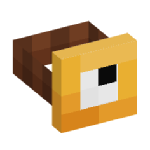
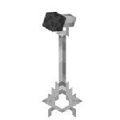
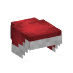

# Таблица доступных предметов

Здесь написаны **все** доступные переименования предметов в ресурспаке на момент версии `v3.0.0-release`.

Предметы с символом * в конце могут быть дополнены символами после основного названия

::: warning ВНИМАНИЕ
В этой статье могут быть ошибки, если вы их найдёте пожалуйста напишите на прямую авторам Вики или в [предложку TRZ Team](https://t.me/TRZteam_bot).
:::

## Еда

|Изображение|Переименование|Предмет|
|:-:|:-:|:-:|
||Луковый суп|Тушёные грибы, свекольный суп, загадочные рагу|
||Роллы|Сырая треска, сырой лосось, тропическая рыба|
||Рататуй|Тушёные грибы, свекольный суп, загадочные рагу|
||Круассан|Хлеб|
||Чипсы|Печёный картофель|
||Яблоко в кармели|Яблоко|
||Бургер|Хлеб|
||Конфета|Печенье|
||Крабовые палочки|Сырая треска, сырой лосось, тропическая рыба|
||Хот-дог|Стейк, хлеб, золотая морковь, жареная крольчатина, жареная курица, жареная свинина|
||Огурец|Морковь|
||Консерва|Стейк, жареная крольчатина, жареная курица, жареная свинина|
||Кусочек пиццы|Стейк, хлеб, золотая морковь, жареная крольчатина, жареная курица, жареная свинина|
||Попкорн|Хлеб|
||Шашлык|Стейк, золотая морковь, жареная крольчатина, жареная курица, жареная свинина|
||Шаурма|Хлеб, золотая морковь|
||Говяжий тартар|Сырая говядина|
||Кусочек торта|Печенье|
||Помидор|Картофель|
||Леденец|Печенье|

## Напитки

|Изображение|Переименование|Предмет|
|:-:|:-:|:-:|
||Бокал вина|Любое зелье|
||Коктейль*|Любое зелье|
||Кофе|Любое зелье|
||Кола в бутылке|Любое зелье|
||Кола в банке|Любое зелье|
||Коньяк|Любое зелье|
||Пиво|Любое зелье|
||Вино|Любое зелье|

## Тотемы

|Изображение|Переименование|Предмет|
|:-:|:-:|:-:|
||Часы|Тотем бессмертия|
||Золотые часы|Тотем бессмертия|
||Маленькие часы|Тотем бессмертия|
||Плюшевый тотем|Тотем бессмертия|
||Воздушный шарик|Тотем бессмертия|

## Музыкальные инструменты

|Изображение|Переименование|Предмет|
|:-:|:-:|:-:|
||Бас-гитара|Кожаная конская броня (Текстура принимает любой цвет)|
||Электрогитара|Кожаная конская броня (Текстура принимает любой цвет)|
||Гитара|Кожаная конская броня (Текстура принимает любой цвет)|
||Медиатор|Кожаная конская броня (Текстура принимает любой цвет)|
||Стойка с микрофоном|Железный слиток|
||Микрофон|Железный слиток|

## Оружие
|Изображение|Переименование|Предмет|
|:-:|:-:|:-:|
||Нож|Любой меч|
||Автомат Калашникова|Лук|
||Deagle|Лук|
||Золотой Deagle|Лук|
||M16|Лук|
||Револьвер|Арбалет|
||Водный пистолет|Лук|

## Головные уборы и броня
|Изображение|Переименование|Предмет|
|:-:|:-:|:-:|
||Шлем полицейского|Любой шлем|
||Нагрудник полицейского|Любой нагрудник|
||Штаны полицейского|Любые поножи|
||Ботинки полицейского|Любые ботинки|
||Коробка|Вырезанная тыква|
||Поварский колпак|Вырезанная тыква|
||Пупа-пупс|Вырезанная тыква|
||Тёмные очки|Вырезанная тыква|
||Рождественский колпак|Вырезанная тыква|
||Ушанка|Вырезанная тыква|
||Клоунский нос|Вырезанная тыква|
||Клоунский парик|Вырезанная тыква|

## Мебель
|Изображение|Переименование|Предмет|
|:-:|:-:|:-:|
||Ноутбук|Железный слиток|
||Чемодан|Любой шалкер|

## ZUNO
### Что такое ZUNO?
ZUNO - карточная игра в ZXRP, созданная на подбие реальной карточной игры [UNO](https://www.letsplayuno.com/).
|Изображение|Переименование|Предмет|
|:-:|:-:|:-:|
||ZUNO 0-9|Кожаная конская броня (Текстура принимает любой цвет)|
||ZUNO plus2|Кожаная конская броня (Текстура принимает любой цвет)|
||ZUNO ANW|Кожаная конская броня (Текстура принимает любой цвет)|
||ZUNO STOP|Кожаная конская броня (Текстура принимает любой цвет)|
||ZUNO COLOR|Кожаная конская броня (Текстура принимает любой цвет)|
||ZUNO CUSTOM|Кожаная конская броня (Текстура принимает любой цвет)|
||ZUNO plus4|Кожаная конская броня (Текстура принимает любой цвет)|

## Прочее

|Изображение|Переименование|Предмет|
|:-:|:-:|:-:|
||Игральная карта|Чистая карта, карта|
||Карта "Дурак"|Чистая карта, карта|
||Наличка|Алмаз (Зависит от количества)|
||Ключ|Любая пластинка|
||Ключ|Пластинка Самуель Оберег - 5|
||Ключ|Пластинка Лена Рейн - Pigstep|
||Ключ|Пластинка Лена Рейн - Creator (Музыкальная шкатулка), Пластинка Лена Рейн - Creator|
||Старая пластинка|Любая пластинка|
||Записка|Бумага|
||Порванная записка|Бумага|
||Трость|Палка|
||Трость с черепом|Палка|
||Дорогая трость|Палка|
||Блокнот|Книга и перо|
||Документ|Книга и перо|
||Газета|Книга и перо|
||Паспорт|Книга и перо|
||Пропуск|Книга и перо|
||Свиток|Книга и перо|
||Баллончик с краской|Кожаная конская броня (Текстура принимает любой цвет)|
||Камера|Железный слиток|
||Какашка|Снежок|
||Рука указка|Палка|
||Гудок|Любой козий рог|
||Воздушный шарик|Палка|

## Дополнительная информация

Версия таблицы `v3.0.0-release`.                                                                                                              
Некоторые текстуры/модели взяты из другого ресурспака [КСЭПСП](https://definitelyawhale.github.io/ksepsp_website/).

### Авторы

Авторы ресурспака: zcript_, TweaksWr, Krisytov, dscss2                                                                                        
Авторы документации: zcript_, dscss2